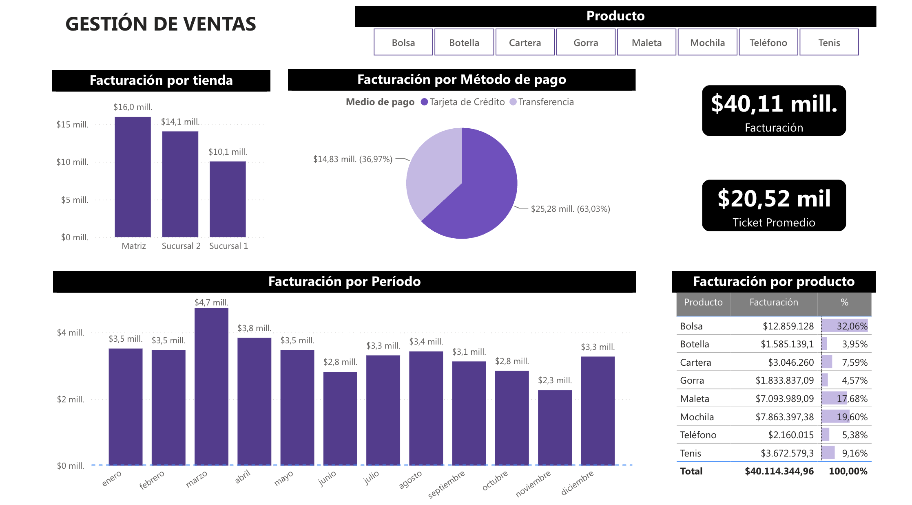

# Sales Management Dashboard 📊

✅ Project Description
This project consists of building an interactive Power BI dashboard to analyze sales performance in a retail business environment.
The dashboard provides insights into key business metrics related to revenue, products, stores, and payment methods, supporting data-driven decision-making.

✅ Objective
Design a dynamic and interactive dashboard that allows users to:

- Analyze total sales revenue
- Evaluate store performance
- Identify top-performing products
- Analyze customer payment methods
- Monitor sales trends over time

✅ Included Visualizations
- Revenue by store
- Revenue by payment method
- Monthly revenue trends
- Revenue by product
- Main KPIs:
  - Total revenue
  - Average ticket

✅ Tools Used
- Power BI
- Power Query
- Data modeling
- Interactive visualizations

✅ Results
An interactive dashboard for sales monitoring was successfully developed.
The analysis helped identify the products and stores with the highest contribution to revenue.
The visualizations improve the understanding of commercial trends and customer purchasing behavior.

✅ How to Use
Download the .pbix file from this repository
Open the file using Power BI Desktop
Explore the interactive visualizations and filters

# Dashboard de Gestión de Ventas 📊

✅ Descripción del proyecto

Este proyecto consiste en el desarrollo de un dashboard interactivo en Power BI para analizar el desempeño de ventas de una empresa retail.
El tablero permite visualizar indicadores clave relacionados con facturación, productos, sucursales y métodos de pago, facilitando el análisis comercial y la toma de decisiones basada en datos.

✅ Objetivo
Diseñar un dashboard dinámico e interactivo que permita:
- Analizar la facturación total de la empresa
- Evaluar el desempeño de cada sucursal
- Identificar los productos con mayor participación en ventas
- Analizar métodos de pago utilizados por los clientes
- Monitorear tendencias de ventas por período

✅ Visualizaciones incluidas
- Facturación por tienda
- Facturación por método de pago
- Facturación por período mensual
- Facturación por producto
- KPIs principales:
  - Facturación total
  - Ticket promedio

✅ Herramientas utilizadas
- Power BI
- Power Query
- Modelado de datos
- Visualizaciones interactivas

✅ Resultados
- Se desarrolló un dashboard interactivo para el monitoreo de ventas.
- El análisis permitió identificar productos y sucursales con mayor contribución a la facturación.
- Las visualizaciones facilitan la interpretación de tendencias comerciales y comportamiento de compra.

✅ Cómo utilizar el proyecto
- Descargar el archivo .pbix del repositorio
- Abrir el archivo en Power BI Desktop
- Explorar las visualizaciones y filtros interactivos

